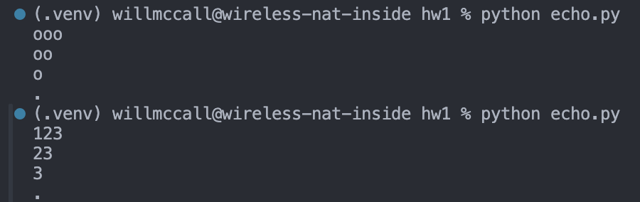

# CS3980-HW1
## Part 1 (echo.py)

## Part 2 (fib.py)

## Part 3 (graph.py)

This graph shows how long each iteration of fib(n) took. Generally speaking, the larger the fibonacci number computed, the longer the function took because it needed to recursively compute each iteration of the fibonacci sequence.
